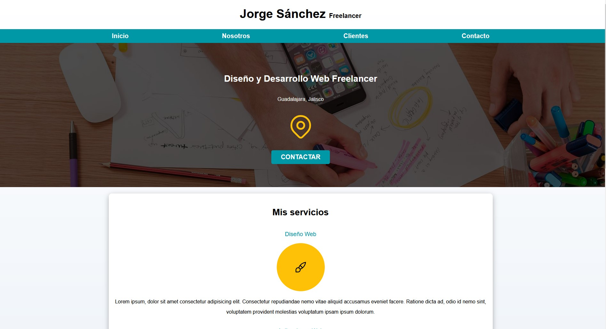
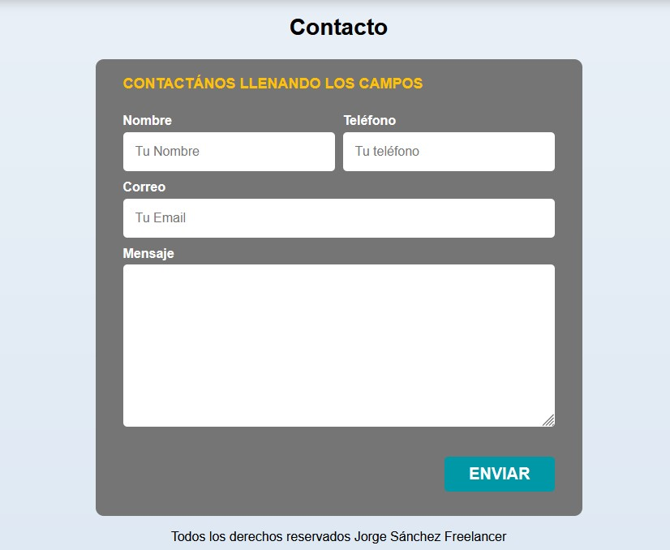

# Practica de estructura de codigo
## Freelancer_inicio

Es un proycto de practica para practicar la estuctura del html y css de manera básica.

Actualmente se encuentra en desarrollo 

Actualmente cuenta con un formualrio el cual no es funcional ya que este proyecto no cuenta con Javascript

